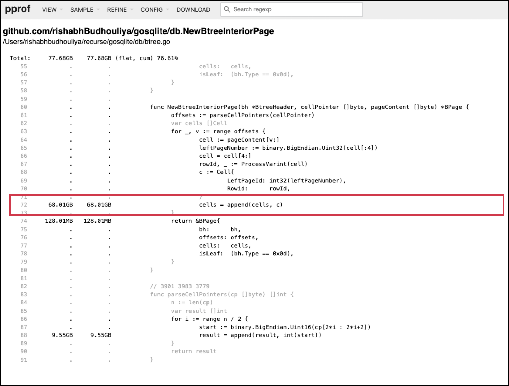

# 8th deadly sin: Writing a storage engine in Go

I launched an ambitious project to create a storage engine in the likeness of SQLite this summer at Recurse Center.

The beautiful thing about trying to write a performant system with inherent constraints of a language like Go is that I developed a deeper relationship with Go and terms to prove technical literacy, like memory safety, are much better understood now.

Okay,
A storage engine in Go? Surely, you've never written a single line of code in a highly performant database.
**Answer**
Yes, I have never written a database by myself and I was always interested in database internals. To me, it was a good force function to learn how they work, and particularly the storage engine layer as it manages all the interaction between the database, kernel and the file system.
The choice of Go was purely a choice of convenience. In retrospect, it was the right choice for me as it taught me that it was a bad idea to use a memory managed language to design a storage engine with

Wait, why SQLite?
**Answer**
I chose SQLite as a reference because it is a fairly easy database to peek into. It's also a highly optimized OLTP database and I was sure a lot about performance can be inferred from it.

I started to write the storage engine like I would write a web app (yes, I'm an expert in this subject). I made the conscious decision of not using generative A.I because this is a hobby, a coffee mug to fill with love and passion, not half-baked efforts.

### What is a storage engine (skip it if you're a database engineer)

===[reference to Database Internals by author-name]===

The storage engine takes care

**Why is it a sin to use Go in this case?**
This is answered through my exploration alongside this blog.
While implementing a B+ Tree search algorithm, it felt right to compare the performance of my database with SQLite as a fun exercise. Little did I know I'd find so much enjoyment in making my code fast. I find joy in finding defects like a detective and trying to fix them.

Part of being a detective is to go over the mundane details of reality but with a lens of suspicion, a burden people seldom like to carry in their day to day life. For me, profiling the CPU and Memory using native Go toolchain was an easy way to understand well B+ tree traversal was working. B+ Tree traversal is imperative to unlock search capabilities.

### Setting the stage - internals of sqlite


To think about a database's internal representation is to think about the constraints enforced by a storage disk. A disk, at the risk of being too dramatic, is like a desert. The ecological rules of the desert forces a human being to maximize the preservation of water within the body. Similarly, a storage disk forces a database engineer to maximize ==packing data locally==, in a structure that allows fast reads and writes. We are used to **O(logn)** guarantees. A B+ tree and SQLite's file format helps SQLite run effortlessly fast.

A B+ tree contains two types of nodes:
1) Interior nodes
2) Leaf nodes
Note: We can use the term node or page interchangeably.
Even the root node is an interior node (unless the entire tree consists of a single page which then also is the leaf page).

Each page or node contains:
1. A header: metadata of the page contents
2. Cell pointer array: offsets that determine location of a cell within the page
3. Cells: The meat of the page. Depending on the page, it can either contain breadcrumbs of where to go next or actual data that we may be in search for.

To appreciate the tomfoolery I had engaged in while trying to build my own database, one has to visualize the magnitude of the problem being solved here.

### What does it mean to search the database?
The search is simple. Based on the given row id, we traverse the tree whose nodes are keyed on row ids.
**Step 1)** Find the root page. Like any tree traversal, we start from the root node.
**Step 2)** Parse the page contents. Depending on the page, the contents can either help us navigate further or be the final destination of our search
**Step 3)** If an interior page, navigate down the tree until we hit on a leaf page
**Step 4)** If a leaf page, extract the row based on given row id (binary search is possible as the leaf nodes are keyed sequentially in ascending order)

### Still setting the stage
I decided to compare my database's search performance for a given row id in a SQLite file with a million rows with native SQLite. It's not a completely fair comparison as SQLite has to perform query parsing, planning and then eventually comes to execution while my code is only performing storage execution. However, all the more reason my database should be faster than SQLite, shouldn't it?

Here, I benchmark both databases using hyperfine and a custom database with 1 million rows. The access pattern is quite naive - sequential row ids stored with minimal data.


SQLite is **8 times faster** than my database for this sequential read of 1 million rows. Understandable? No. I reject resting on the comfort of knowing SQLite is a highly optimized C code, tuned to have a low footprint and be highly performant.
[Richard Hipp] 1 [Rishabh] 0 **(Spoiler alert: I never score a point)**

### Investigating my defeat

The story starts from looking at the Call Graph of CPU execution profile. It's a mouthful, isn't it? Imagine being able to trace the lineage of each thought that has led to arrive at the current moment in your life - that's what a call graph is to a software's running lifecycle.

This visual representation is a watered down Call Graph from `pprof`
Two things that immediately jump out:
1) The distribution of CPU execution time is highly skewed towards the System. This involves <all the things Go has to do to make my program work>
2) What causes this skewness? **runtime.systemstack** takes a near **50%** chunk of the total execution time. That begs a further inspection into what causes this?
3) In terms of individual sys calls, we have
   1) runtime.gcBgMarkWorker: It represents a baseline for how much time the application spends marking and scanning the object graph. (GC stuff)
   2) runtime.kevent: represents the amount of time application waits on I/O operations.
   3) runtime.startTheWorldWithSema: A proxy indicator for GC frequency, it denotes the end of a "Stop the world" event
   4) runtime.usleep: Go tries to insert small delays to manage contention. Usually represents a bottleneck related to shared resources. Could be our blocking disk reads.

We read from disk and that's essentially what we do in search so it makes sense we'd spend time here.

Now, I like to not remember what sys calls bungles my performance. Instead, we can broadly categorize the leakage in latency as
1) Garbage collection effort from GC
2) A lot of waiting stemming from blocking disk reads and GC work
3) Significant amount of heap memory allocations

This is enough evidence to go back and take a hard look at my code again. However, my stubbornness needed more proof and the next step in that direction would be

### Who is generating all this garbage?

With the help of our savior `pprof`, I used the memory profile to showcase the call graph that traces total allocation in terms of bytes (reserved and freed). In other words, I'm interested to know what part of my code creates a lot of garbage.

Here's a sweet picture


Great. Here's another way to display that the functions within search are allocating a LOT of space.

At this point, we have undeniable incentive to take a look under the search algorithm. `pprof` won't even let you hide behind function name. It attaches profile results with the source code - making zeroing on what specific lines of code contribute towards the problem easy.

Before I move on to what was wrong in code and how I fixed it, I should discuss the file format of sqlite. Can't avoid it.

### How is this related to our current problem?
Remember the three big functions that are generating a lot of garbage?
- NewBtreeInteriorPage
- GetPage
- ParseCellPointers

On a closer inspection of my code, there was a clear problem in the deserialization of pages.
To be more specific,

### Old way of creating pages

```go
func NewBtreeInteriorPage(bh *BtreeHeader, cellPointer []byte, pageContent []byte) *BPage {
	offsets := parseCellPointers(cellPointer)
	var cells []Cell
	for _, v := range offsets {
		cell := pageContent[v:]
		leftPageNumber, startRowId := ProcessVarint(cell)
		cell = cell[startRowId:]
		rowId, _ := ProcessVarint(cell)
		c := Cell{
			LeftPageId: int32(leftPageNumber),
			Rowid:      rowId,
		}
		cells = append(cells, c)
	}
	return &BPage{
		bh:      bh,
		offsets: offsets,
		cells:   cells,
		isLeaf:  (bh.Type == 0x0d),
	}
}
```


Focusing at the red block of memory profile at source, we're witnessing a severe penalty on using variable-sized unbounded slices. A cumulative 68 GB heap allocation could be a good enough reason for the GC to fire up frequently.

This realization prompted  a complete overhaul of the deserialization strategy. I leaned into the philosophy of zero-copy reads. To remediate the biggest fault
- The idea of deserialization of cells in memory serves no purpose for our use case. We wish to extract data from the cells and use it to navigate the B+ tree. Why not deserialize it on-demand and use that data to navigate?

I unified the Page creation process. Both Interior and Leaf pages have the same constructor and most importantly, we keep the content in its raw state, thus, avoiding the penalty of creating huge heavy slices.

```go
type InteriorPage struct {
	BasePage
}

func NewPage(bh *BtreeHeader, cellPointer []byte, pageContent []byte) Page {
	base := BasePage{
		bh:      bh,
		offsets: parseCellPointers(cellPointer),
		content: pageContent,
	}
	switch bh.Type {
	case 0x0d:
		return &LeafPage{BasePage: base}
	case 0x05:
		return &InteriorPage{BasePage: base}
	default:
		return nil
	}
}
```

### Perils of using an experimental package, even if it is official

It's natural to assume that a database to develop a deep relationship with the filesystem and the storage device that backs it. I entered a situationship with the disk storage by using Go's mmap library. Mmap offers two benefits
1) It takes on the responsibility to cache and manage the lifecycle of pages from the disk
2) Has its own cache eviction policies
This is a great relief in terms of memory management. My application doesn't have to allocate and manage memory for these pages.

**BUT**

I was managing the raw bytes. It was happening due to the weird specification of the function `mmap.ReaderAt()`. It asks for a buffer to copy the raw bytes of a page read from I/O. If my program maintains a buffer to store the page contents, that means it also needs to manage the lifecycle of this object in memory. That kind of voids the benefit of using a sys call like mmap. We intended it to manage pages for us, I don't my application to handle that.

Evidently, heap allocation traces at source showcase a sizable cumulative memory allocation to this buffer (which is not of a constant size, mind you).
**Problem with `GetPage`**


The answer was to replace Go's package with a direct syscall to mmap. Imagine mmap to offer us a pie and this pie is filled with all the data of our database. Now, I get to take the pie and not keep it. I don't want to keep the pie with me and that makes my code faster.

```diff
@@ -4,13 +4,22 @@
  if err != nil {
   return err
  }
- mm, err := mmap.Open(filename)
- if err == nil {
-  p.f = f
-  p.mm = mm
- } else {
+ stat, err := f.Stat()
+ if err != nil {
   f.Close()
   return err
  }
+ fileSize := stat.Size()
+
+ data, err := unix.Mmap(int(f.Fd()), 0, int(fileSize), unix.PROT_READ, unix.MAP_SHARED)
+ if err != nil {
+  f.Close()
+  return err
+ }
+ if err := unix.Madvise(data, unix.MADV_SEQUENTIAL); err != nil {
+  fmt.Printf("Madvise warning: %v", err)
+ }
+ p.f = f
+ p.data = data
  return nil
 }
```

Here, we see the benefit of using the unix sys call. We get to slice the data directly and use it.
```diff
 func (p *Pager) GetPage(pageNum uint32, pageSize int) ([]byte, error) {
- // page number will start from 1 to N (sequential)
-
- pageOffset := (int64(pageNum-1) * int64(pageSize))
- buff := make([]byte, pageSize)
- _, err := p.mm.ReadAt(buff, pageOffset)
- return buff, err
+ start := int64(pageNum-1) * int64(pageSize)
+ end := start + int64(pageSize)
+ if start < 0 || end > int64(len(p.data)) {
+  return nil, io.EOF
+ }
+ pageSlice := p.data[start:end]
+ return pageSlice, nil
 }
```

# Result

[insert SVG]
And
[diagram with performance difference]
